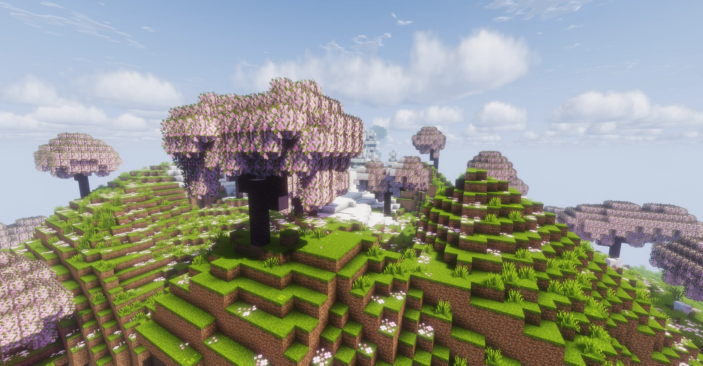

# Creating a Tree That Changes Color with the Seasons

This tutorial uses cherry leaves as an example to add four seasonal appearances to a block: spring, summer, autumn, and winter.

After completing this tutorial, you will have:

- Pink cherry leaves in spring
- Green leaves in summer
- Red leaves in autumn
- Dry yellow-brown leaves in winter

The same method can also be used for:

- Azalea leaves
- Modded leaves
- Crops
- Custom plants



## Choosing a Method

Ecliptic Seasons provides two ways to create seasonal appearances.

### season_textures

Suitable for:

- Normal leaves
- Simple plants
- Simple BlockStates

Advantages:

- Fewer files
- Easy to create
- No additional models required

### season_definitions

Suitable for:

- Complex BlockStates
- Multipart models
- Model switching
- Solar-term transitions
- Resource packs that require full seasonal support

Advantages:

- Complete functionality
- Highly extensible

For most leaves, it is recommended to try `season_textures` first.

------

# Method 1: Using season_textures

## Resource Pack Structure

```text
assets/
└─ example/
   ├─ eclipticseasons/
   │  └─ season_textures/
   │     └─ cherry_leaves.json
   └─ textures/
      └─ block/
         ├─ cherry_leaves_spring.png
         ├─ cherry_leaves_summer.png
         ├─ cherry_leaves_autumn.png
         └─ cherry_leaves_winter.png
```

## Creating Seasonal Textures

Prepare four leaf textures:

```text
cherry_leaves_spring.png
cherry_leaves_summer.png
cherry_leaves_autumn.png
cherry_leaves_winter.png
```

For example:

| Season | Color        |
| ------ | ------------ |
| Spring | Pink         |
| Summer | Green        |
| Autumn | Red          |
| Winter | Yellow-brown |

## Creating a Seasonal Texture Definition

Create:

```text
assets/example/eclipticseasons/season_textures/cherry_leaves.json
```

```json
{
  "target": "minecraft:block/cherry_leaves",
  "biomes": "#eclipticseasons:seasonal",

  "slices": [
    {
      "season": "spring",
      "textures": {
        "all": "example:block/cherry_leaves_spring"
      },
      "tint": {
        "#all": -1
      }
    },
    {
      "season": "summer",
      "textures": {
        "all": "example:block/cherry_leaves_summer"
      },
      "tint": {
        "#all": -1
      }
    },
    {
      "season": "autumn",
      "textures": {
        "all": "example:block/cherry_leaves_autumn"
      },
      "tint": {
        "#all": -1
      }
    },
    {
      "season": "winter",
      "textures": {
        "all": "example:block/cherry_leaves_winter"
      },
      "tint": {
        "#all": -1
      }
    }
  ]
}
```

After this is done, the leaves will automatically use the corresponding texture in each season.

## When Should You Not Use season_textures?

Although `season_textures` is convenient, it is not suitable for every block.

Recommended use cases:

- Leaves
- Flowers
- Simple plants
- Models referenced by simple BlockState state machines

Not recommended for:

- BlockStates with many variants
- Multipart models
- Complex block states
- Blocks that need to switch model structure

For these cases, use `season_definitions` instead.

------

# Method 2: Using season_definitions

If you want to switch the entire model instead of only replacing textures, use `season_definitions`.

Resource pack structure:

```text
assets/example/eclipticseasons/season_definitions/
assets/example/eclipticseasons/model_definitions/
assets/example/models/block/
assets/example/textures/block/
```

Example:

```json
{
  "blocks": "minecraft:cherry_leaves",

  "slices": [
    {
      "season": "spring",
      "mid": "example:cherry_leaves_spring"
    },
    {
      "season": "summer",
      "mid": "example:cherry_leaves_summer"
    },
    {
      "season": "autumn",
      "mid": "example:cherry_leaves_autumn"
    },
    {
      "season": "winter",
      "mid": "example:cherry_leaves_winter"
    }
  ]
}
```

Then map these `mid` values to actual models in `model_definitions`.

This method is more suitable for:

- Solar-term flowering
- Solar-term leaf fall
- Lotus blooming
- Fruit ripening
- Snow-covered appearances
- Complex tree resource packs

------

# Adding Seasonal Support to Azalea Leaves

To make azalea leaves change with the seasons as well:

```json
{
  "target": [
    "minecraft:block/azalea_leaves",
    "minecraft:block/flowering_azalea_leaves"
  ]
}
```

Or:

```json
{
  "blocks": [
    "minecraft:azalea_leaves",
    "minecraft:flowering_azalea_leaves"
  ]
}
```

Keep the rest of the configuration the same.

------

# Next Steps

After completing seasonal textures, you can continue reading:

- [Season Models / Season Definitions](../custom/season_definitions.md)
- [Snow Models / Snow Definitions](../custom/snow_definitions.md)
- [Fallen Leaves](../custom/fallen_leaves.md)

Add richer seasonal effects to your trees, such as:

- Solar-term flowering
- Autumn leaf fall
- Winter snow cover
